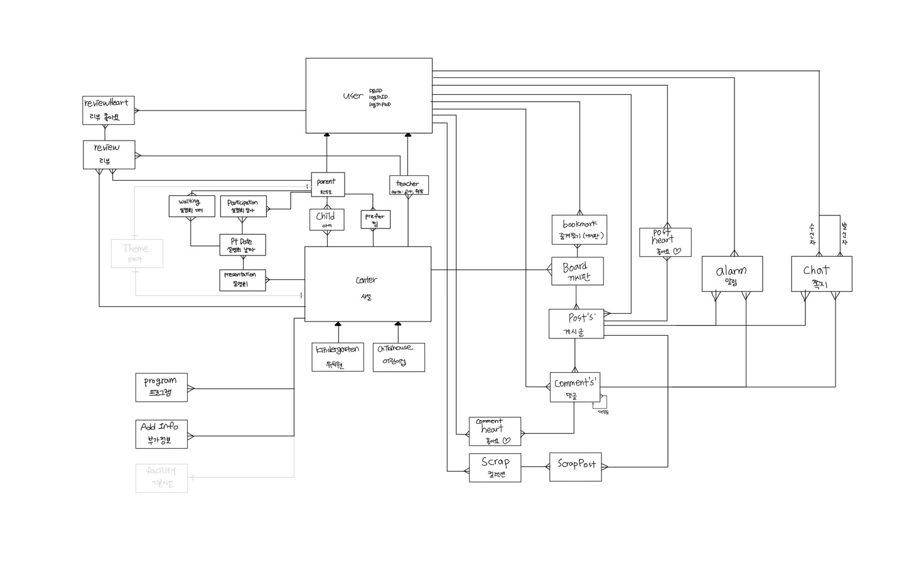

<h1>아이러빗 Backend</h1>

## 🏫 [아이러빗 바로가기][iluvit-link]
[iluvit-link]: https://iluvit.app/

## 📱 주요기능

1️⃣ 위치 기반 유아시설 조회
- 상세 내용

2️⃣ 커뮤니티
- 상세 내용

3️⃣ 설명회
- 상세 내용

## 🔍 Architecture
사진 넣어야됨

## 🖥 기술 스택
     

## ERD

## 🧑🏻‍💻 Contributors
| name | position   | github                    |
|------|------------|---------------------------|
| 현승구  | BackEnd    | https://github.com/digda5624      |
| 이승범  | BackEnd | https://github.com/sbl133 |
| 이창윤  | BackEnd | https://github.com/rooni97 |
| 최민아  | BackEnd | https://github.com/minah9999 |

## ⚙️ Release Note
### 2022-09-08
> Readme 파일 생성
